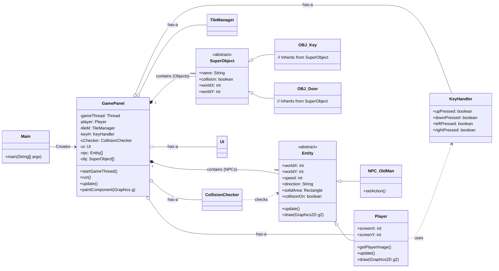

# 類別圖

此圖表顯示了遊戲中主要類別之間的靜態關係，包括繼承和組合。

```mermaid
classDiagram
    direction LR

    class Main {
        +main(String[] args)
    }

    class GamePanel {
        -gameThread: Thread
        -player: Player
        -tileM: TileManager
        -keyH: KeyHandler
        -cChecker: CollisionChecker
        -ui: UI
        -npc: Entity[]
        -obj: SuperObject[]
        +startGameThread()
        +run()
        +update()
        +paintComponent(Graphics g)
    }

    class KeyHandler {
        +upPressed: boolean
        +downPressed: boolean
        +leftPressed: boolean
        +rightPressed: boolean
    }

    class Entity {
        <<abstract>>
        +worldX: int
        +worldY: int
        +speed: int
        +direction: String
        +solidArea: Rectangle
        +collisionOn: boolean
        +update()
        +draw(Graphics2D g2)
    }

    class Player {
        +screenX: int
        +screenY: int
        +getPlayerImage()
        +update()
        +draw(Graphics2D g2)
    }

    class NPC_OldMan {
        +setAction()
    }
    
    class SuperObject {
        <<abstract>>
        +name: String
        +collision: boolean
        +worldX: int
        +worldY: int
    }
    
    class OBJ_Key {
        // Inherits from SuperObject
    }
    
    class OBJ_Door {
        // Inherits from SuperObject
    }

    Main --> GamePanel : Creates
    GamePanel o-- Player : has-a
    GamePanel o-- TileManager : has-a
    GamePanel o-- KeyHandler : has-a
    GamePanel o-- CollisionChecker : has-a
    GamePanel o-- UI : has-a
    GamePanel "1" *-- "many" Entity : contains (NPCs)
    GamePanel "1" *-- "many" SuperObject : contains (Objects)

    Entity <|-- Player
    Entity <|-- NPC_OldMan
    
    SuperObject <|-- OBJ_Key
    SuperObject <|-- OBJ_Door

    Player ..> KeyHandler : uses
    CollisionChecker ..> Entity : checks
```
