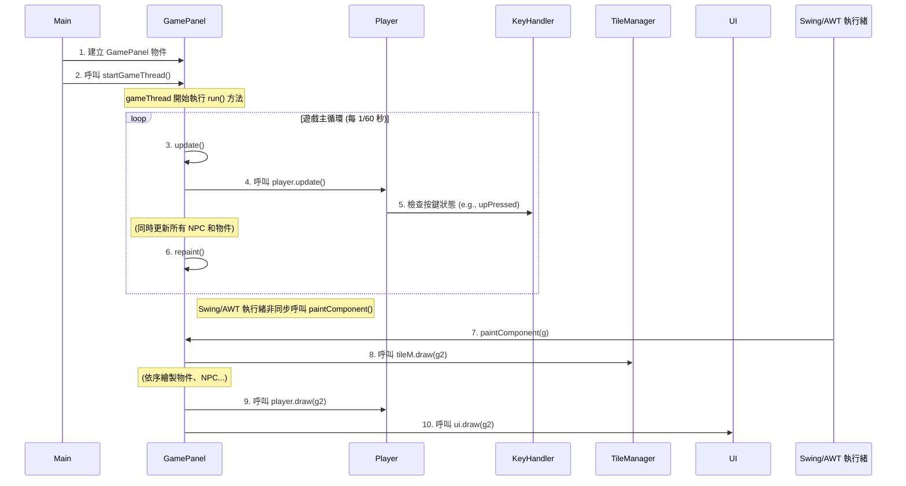

# 循序圖

此圖表展示了遊戲主循環（Game Loop）期間，各個核心物件之間的互動順序。

### 流程說明：

1.  **初始化**: `Main` 類別建立 `GamePanel` 的實例並啟動其主執行緒 `gameThread`。
2.  **遊戲循環**: `gameThread` 進入一個無限循環。
3.  **更新邏輯**: 在循環的每一輪，`GamePanel` 的 `update()` 方法被呼叫，它會觸發所有遊戲實體（如 `Player`）的更新。
4.  **輸入處理**: `Player` 在其 `update()` 方法中，會向 `KeyHandler` 查詢當前的按鍵狀態來決定如何移動。
5.  **請求渲染**: `update()` 完成後，`GamePanel` 呼叫 `repaint()`，向 Swing/AWT 系統請求重新繪製畫面。
6.  **執行渲染**: Swing/AWT 的繪圖執行緒（EDT）在適當的時機呼叫 `GamePanel` 的 `paintComponent()` 方法。
7.  **繪製畫面**: `paintComponent()` 按照固定的層次順序（背景、物件、玩家、UI）呼叫各個元件的 `draw()` 方法，最終將完整的遊戲畫面渲染到螢幕上。
